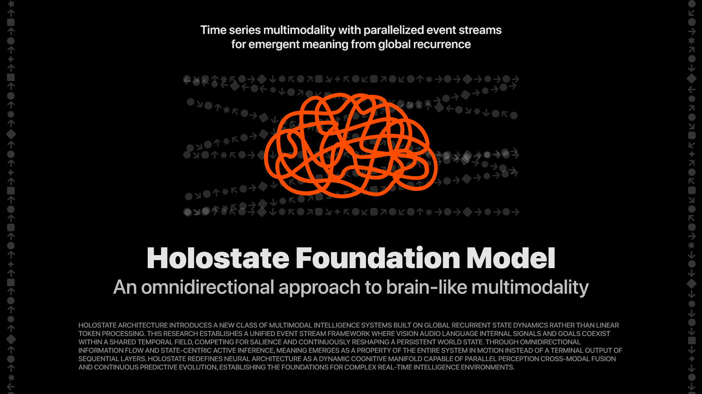
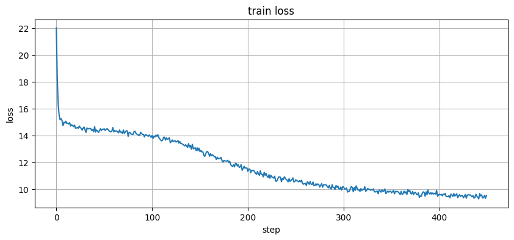
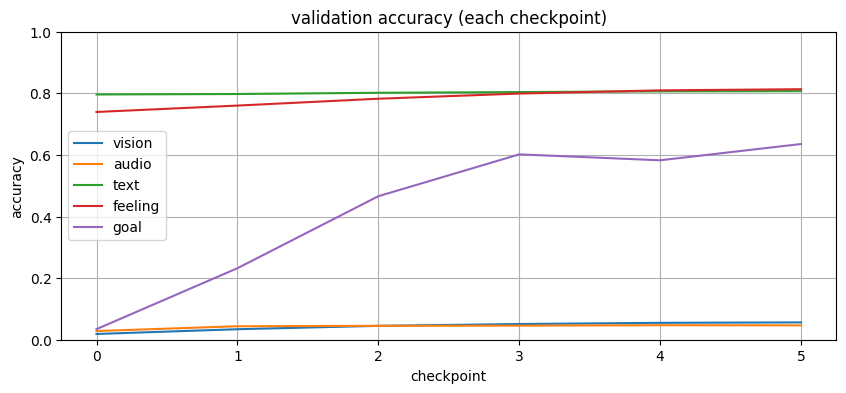
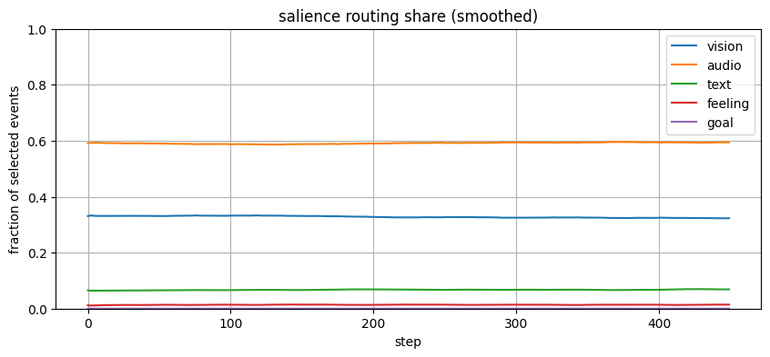

# Holostate Foundation Model
Time series multimodality with parallelized event streams for emergent meaning from global recurrence.

Holostate Architecture introduces a new class of multimodal intelligence systems built on global recurrent state dynamics rather than linear token processing. This research establishes a unified event stream framework where vision, audio, language, internal signals, and goals coexist within a shared temporal field, competing for salience and continuously reshaping a persistent world state.

Through omnidirectional information flow and state-centric active inference, meaning emerges as a property of the entire system in motion instead of a terminal output of sequential layers. Holostate redefines neural architecture as a dynamic cognitive manifold capable of parallel perception, cross-modal fusion, and continuous predictive evolution, establishing the foundations for complex real-time intelligence environments. 

Inspired by ["The Brain’s Learning Algorithm Isn’t Backpropagation"](https://www.youtube.com/watch?v=l-OLgbdZ3kk)

